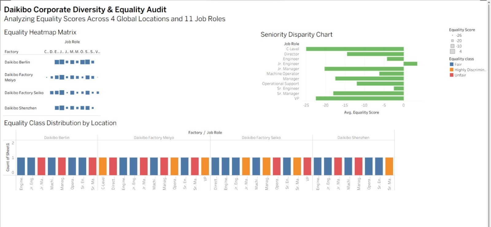

# Workplace Equality & Pay Gap Analysis

## Overview
Analyzed pay/opportunity equality scores across factory job roles using Tableau, 
identifying roles and locations with the highest disparity to support DEI 
(Diversity, Equity & Inclusion) reporting.

## Key Insights
- Classified roles into Fair, Unfair, and Highly Discriminative equality bands 
  based on equality score thresholds
- [Factory name] showed the most severe disparities at senior levels 
  (C-Level, VP, Director), while technical/engineering roles trended closer to fair
- Identified [X]% of roles across factories falling into the "Highly Discriminative" band

## Tools Used
- Tableau (dashboard & visualization)
- Excel (data source)

## Dataset
Raw data: [Equality_Table.xlsx](Equality_Table.xlsx)
